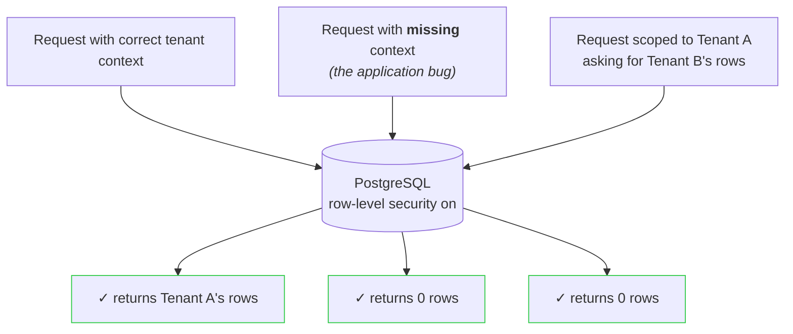
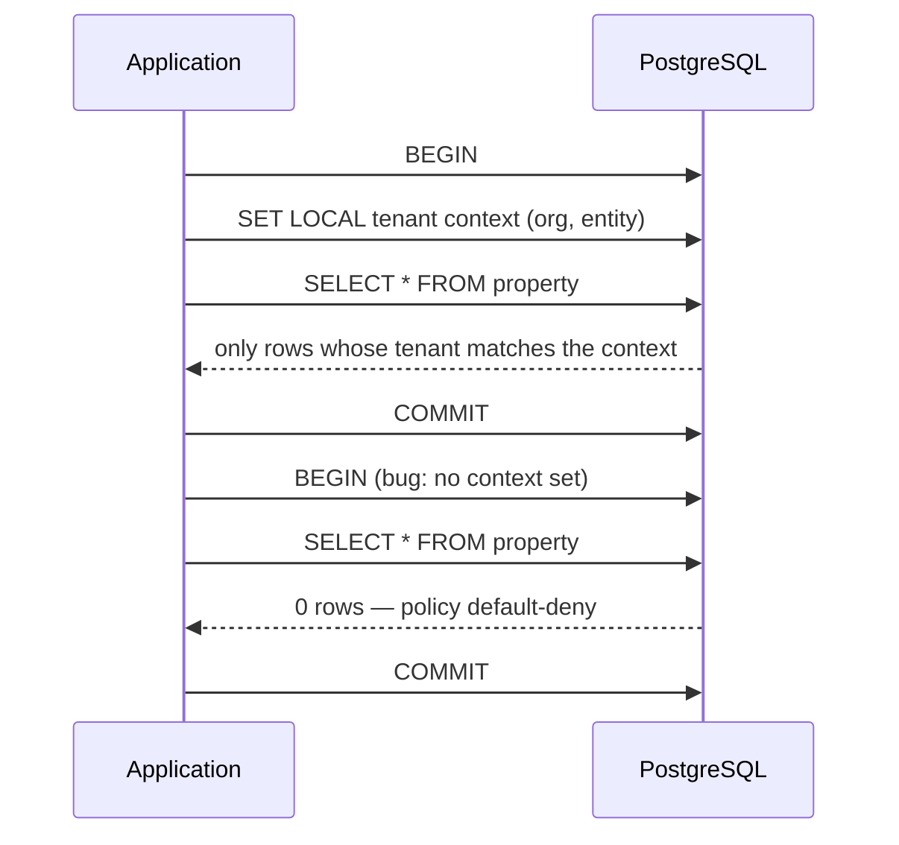

# Multi-Tenant Isolation at the Database Layer

Multi-tenant apps usually trust every query to remember its tenant filter. This project doesn't: **PostgreSQL enforces the tenant boundary itself**, so an application bug returns zero rows instead of another customer's data.



Nothing in the application blocks the second and third requests. The database does.

## See It Work

```bash
docker compose up -d          # throwaway Postgres 16
./scripts/default-deny-demo.sh
```

```text
1. SCOPED QUERY   (app set tenant context)    → 2 rows
2. UNSCOPED QUERY (app forgot the context)    → 0 rows
3. CROSS-TENANT   (A asking for B's rows)     → 0 rows
```

- Case 1 is a normal request: the app states which tenant it is acting for, and gets that tenant's rows.
- Cases 2 and 3 are the failure modes that leak data in most stacks. Here both return nothing.
- A full 13-group suite (`./scripts/validate-rls.sh`) runs the same checks plus write attempts, forged context, and bypass attempts — 13/13 pass.

## The Problem

In a typical multi-tenant app, isolation lives in application code: every query must include `WHERE tenant_id = :current_tenant`. That works until it doesn't — one forgotten filter in one endpoint, one new developer, one refactored query, and customers see each other's data. Code review reduces the odds; it cannot reduce them to zero.

The fix is to move the boundary out of the application entirely. The database already knows which rows belong to which tenant; it should refuse to return anything else no matter what the asking query looks like.

## How It Works



1. Every request states its tenant context inside its own transaction.
2. Every tenant table has a row-level security policy that compares each row against that context.
3. No context, wrong context, or missing context → the policy matches nothing → zero rows.

## Engineering Highlights

### 1. The database, not the application, is the last line of defense

Any developer can write a query that forgets the tenant filter; review lowers the odds but never to zero. Row-level security policies move enforcement to the one layer that sees every query. The tradeoff is deliberate: a query without valid context silently returns nothing, which can be harder to debug than an error — a confusing empty result beats a cross-tenant leak.

### 2. Tenant context travels safely into the database

Postgres session variables can't be parameterized like ordinary values, so setting them from application data is an injection risk. Context is set inside the request's own transaction (`SET LOCAL`, so it expires with the transaction and can't leak to the next request on a pooled connection), and every tenant id is validated against a strict UUID format before it is ever interpolated. Malformed input fails closed before reaching the database.

### 3. Adversarial verification

An isolation claim is only as good as the tests trying to break it. The validation suite runs as plain SQL against the live database and deliberately attempts the failures that matter: missing context, wrong tenant, cross-tenant writes, forged or empty context, and a session trying to switch row-level security off (the database errors instead of complying). The same suite runs in staging with writes and in production read-only before any deploy.

## Technical Deep Dive: default-deny by sentinel

The interesting part is what a policy does when the context is *absent*. Each policy coalesces a missing or empty context to a sentinel UUID that can never match a real row:

```sql
organization_id = coalesce(
  nullif(current_setting('app.current_org', true), ''),
  '00000000-0000-0000-0000-000000000000'
)::uuid
```

No real row carries the nil UUID, so a contextless query is not rejected loudly — it matches nothing and returns an empty result. `FORCE ROW LEVEL SECURITY` keeps the policy active even for the table owner, closing the "connected with the wrong role" hole.

## Run It

```bash
docker compose up -d
./scripts/default-deny-demo.sh   # the 3-case outcome above
./scripts/validate-rls.sh        # full adversarial suite (13 groups)
./scripts/verify-rls.sh          # structural CI gate
```

Requires Docker and `psql`.

## Public Showcase Scope

| Component | Status | Detail |
|---|---|---|
| RLS policy design | Real | Faithful reconstruction of the production policy pattern (default-deny, `FORCE RLS`, separate read/write rules). |
| Tenant-context protocol | Reconstructed | Generic names; original role names and database names replaced. |
| Validation suite | Reconstructed | Same structure and edge cases as the production suite; fewer tables (3 vs 12). |
| Data model | Reconstructed | Minimal equivalent: Organization → Entity → Property/Invoice. |
| Seed data | Mocked | Fixed UUIDs, no real customer data. |
| Infrastructure & app framework | Omitted | No Azure, Clerk, Sentry, NestJS/Prisma — the proxy pattern is documented above. |
| Credentials | Sanitized | Demo-only password for a throwaway Docker Postgres. |

Extracted from a private multi-tenant property-management SaaS where the production version of this design runs on 12 tenant tables.

## About

Built by Sebastian O. Rodriguez. The interesting problem here was not writing the policies — it was proving they survive application bugs, and shipping that proof to run in staging and production.
