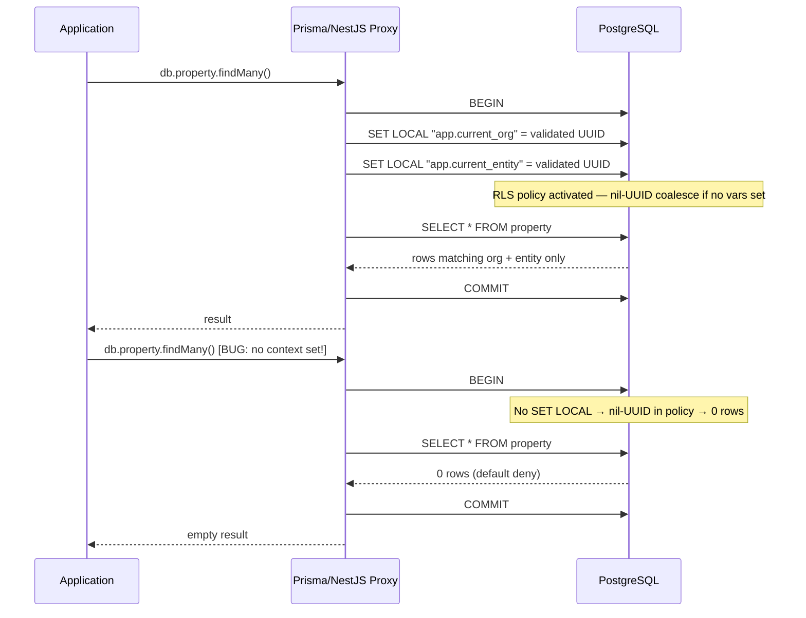

# DB-Enforced Multi-Tenant Isolation (PostgreSQL RLS)

> **One strong sentence:** PostgreSQL Row-Level Security enforces tenant isolation at the database — not application code — so a bug that forgets session vars returns zero rows instead of leaking another tenant's data.

**[Hero Proof](docs/hero-proof.svg)**: scoped query → 2 rows; unscoped query → 0 rows; cross-tenant query → 0 rows. All 13 validation groups pass.

---

## What It Does

A minimal multi-tenant property-management SaaS model where every data-access query passes through PostgreSQL Row-Level Security policies. The application connects as a restricted non-superuser role (`app_role`). Before any query, the application layer sets session-context variables (`SET LOCAL "app.current_org" = …`, `"app.current_entity" = …`) inside a transaction. The RLS USING clause coalesces missing/empty variables to the nil UUID (`00000000-…`), which matches no real row — **default deny**.

The validation suite (13 groups) proves isolation survives every plausible edge case: cross-org reads, dashboard multi-entity paths, malformed session vars, WITH CHECK write violations, and forced `row_security = off` (which errors instead of bypassing RLS).

---

## Demo

```bash
# 1. Start PostgreSQL
docker compose up -d

# 2. Run the hero-proof default-deny demo
./scripts/default-deny-demo.sh

# 3. Run the full 13-group validation suite
./scripts/validate-rls.sh

# 4. Quick structural check (CI gate)
./scripts/verify-rls.sh
```

### What You See

```
$ ./scripts/default-deny-demo.sh

RLS Default-Deny Demo — defense-in-depth survives an app bug
Connected as: app_role (restricted, non-superuser)

═══════════════════════════════════════════════════════════════
  1. SCOPED (CORRECT) QUERY — app set session vars
═══════════════════════════════════════════════════════════════
 visible_properties
--------------------
                  2
(1 row)

═══════════════════════════════════════════════════════════════
  2. UNSCOPED QUERY — app FORGOT session vars (the bug)
═══════════════════════════════════════════════════════════════
 visible_properties   | visible_invoices
-------------------- | ----------------
                  0   |                0

═══════════════════════════════════════════════════════════════
  RESULT
═══════════════════════════════════════════════════════════════
Scoped query returns rows; unscoped and cross-tenant queries return 0.
Isolation is enforced by PostgreSQL, not by application code.
```

---

## Architecture



### Key Mechanism: Default-Deny via Nil UUID Coalesce

Every RLS policy uses this pattern:

```sql
CREATE POLICY tenant_isolation ON property
  FOR ALL
  USING (
    organization_id = coalesce(
      nullif(current_setting('app.current_org', true), ''),
      '00000000-0000-0000-0000-000000000000'
    )::uuid
    AND (
      entity_id = coalesce(...)::uuid
      OR entity_id = ANY(string_to_array(...))
    )
  )
  WITH CHECK (
    organization_id = coalesce(...)::uuid
    AND entity_id = coalesce(...)::uuid
  );
```

- Missing/empty session var → `nullif` returns null → `coalesce` returns nil UUID → never matches a real UUID → **zero rows**.
- `FORCE ROW LEVEL SECURITY` applies policies even to the table owner.
- `WITH CHECK` is separate from `USING` — writes require the single `current_entity`, no `allowed_entities` fallback.
- `allowed_entities` (comma-separated list) is used only when `current_entity` is absent (dashboard/multi-entity views).

---

## Engineering Highlights

### 1. FORCE RLS + Default-Deny via Nil UUID Coalesce

**Constraint:** Application code can have bugs — a developer might forget to set session context. The database MUST be the last line of defense.

**Implementation:** Every RLS `USING` clause coalesces missing session vars to `00000000-0000-0000-0000-000000000000`. This UUID is never a real row ID. When the app forgets `SET LOCAL`, the policy evaluates to `organization_id = nil` — false for every row. **Zero rows returned.**

**Tradeoff:** The nil UUID is a sentinel value. It's impossible to create a real row with that ID (UUID generation is random), but the policy is slightly verbose. The verbosity is intentional — it makes the default-deny logic explicit and auditable in a single SQL expression.

**Result:** Group 1 of the validation suite confirms: with no session vars, `SELECT count(*) FROM property` returns 0. The app cannot leak data by omission.

### 2. Session-Variable Injection via Transaction Proxy

**Constraint:** PostgreSQL `SET LOCAL` does not support parameterized queries — session variables must be set via string interpolation. This is a SQL injection vector.

**Implementation:** A UUID validation regex (`/^[0-9a-f]{8}-[0-9a-f]{4}-[0-9a-f]{4}-[0-9a-f]{4}-[0-9a-f]{12}$/i`) runs before any `SET LOCAL` interpolation. Only valid UUIDs pass through. Invalid values throw an error before reaching PostgreSQL. The session vars are injected inside a `$transaction` wrapper so the `SET LOCAL` and the actual query share the same connection.

**Tradeoff:** String interpolation is unavoidable here — PostgreSQL's `SET` doesn't accept `$1` parameterization. The UUID regex gives us a hard gate: the only values that reach the interpolated string are 36-character hex strings with dashes at fixed positions. Even a malicious input that somehow passes the regex is still a UUID — it's harmless as a session variable value.

**Result:** Groups 9 and 10 confirm: empty strings → nil UUID → 0 rows; garbage UUIDs → cast error → fails closed.

### 3. Separate USING vs WITH CHECK Policies

**Constraint:** Reads and writes have different isolation requirements. A dashboard view (multi-entity) should be allowed for reads but not for writes — you shouldn't be able to INSERT into the wrong entity via a dashboard.

**Implementation:** `USING` allows the `allowed_entities` fallback path (multi-entity reads). `WITH CHECK` does NOT — writes must target the single `current_entity`. This means `SELECT` with `allowed_entities` sees multiple entities, but `INSERT`/`UPDATE` through the same context is rejected.

**Tradeoff:** The duality is slightly more complex to reason about, but it prevents a class of bugs where a dashboard-scoped session accidentally writes to the wrong entity.

**Result:** Groups 7 and 8: INSERT with wrong entity_id → rejected; UPDATE to wrong org_id → rejected.

### 4. DDL-Enforced RLS Verification at Startup

**Constraint:** Misconfiguration — connecting as superuser, missing RLS on a table, no policies — silently disables isolation. An operator might swap connection strings incorrectly.

**Implementation:** `verifyRlsConfiguration()` runs at application startup. It checks: (1) connection is NOT superuser, (2) `relrowsecurity` is true on every tenant table, (3) at least one policy exists on every table. Any failure throws a hard error — the application refuses to start.

**Tradeoff:** The startup check adds a few hundred milliseconds to cold-start. The trade is worth it: a misconfigured deployment never serves traffic.

**Result:** The `verify-rls.sh` script (5 checks) confirms all structural guards are in place.

### 5. FORCE ROW LEVEL SECURITY on Table Owner

**Constraint:** If the table owner connects (not superuser, but owns the table), RLS is normally bypassed for the owner. A connection-string misconfiguration could expose all rows.

**Implementation:** `FORCE ROW LEVEL SECURITY` on every tenant table. This makes RLS apply even to the table owner. Combined with the startup superuser check, there is no role that can bypass RLS.

**Result:** The `app_role` role has no `BYPASSRLS` attribute. Setting `row_security = off` causes queries to error (fail closed) rather than returning rows — Group 13 confirms.

---

## Technical Deep Dive

### The RLS Policy in Detail

The two policy types cover all operations:

**Entity-scoped tables** (property, invoice):
- `USING`: `organization_id = current_org AND (entity_id = current_entity OR entity_id IN allowed_entities)`
- `WITH CHECK`: `organization_id = current_org AND entity_id = current_entity` (no allowed_entities)

**Org-scoped tables** (entity):
- `USING`/`WITH CHECK`: `organization_id = current_org`

### Session Context Protocol

The application (or psql demo) sets these before each query:

| Variable | Type | Required | Purpose |
|---|---|---|---|
| `app.current_org` | UUID | Yes | Scopes to one organization |
| `app.current_entity` | UUID | For writes | Scopes to one entity |
| `app.allowed_entities` | CSV UUIDs | Dashboard reads | Multi-entity read access |

### Data Model

```
organization (NOT RLS-protected — root boundary, discovered via membership)
    └── entity (org-scoped: visible only when current_org matches)
        ├── property (entity-scoped: visible via current_entity or allowed_entities)
        └── invoice (entity-scoped: same pattern)
```

---

## Tech Stack

- **PostgreSQL 16** (Alpine, Docker) — RLS, FORCE RLS, custom session variables
- **Bash + psql** — validation suite runner
- **PL/pgSQL** — DO blocks for assertion logic inside BEGIN/ROLLBACK transactions

---

## Run It

### Prerequisites
- Docker & Docker Compose
- `psql` (PostgreSQL client, any version)

### Quick Start

```bash
git clone <this-repo>
cd showcase-pmlad

# Start PostgreSQL (port 5433)
docker compose up -d

# Wait for healthy (about 3 seconds)
docker compose ps

# Run the hero demo
./scripts/default-deny-demo.sh

# Run the full validation suite (13 PASS groups)
./scripts/validate-rls.sh

# Run the structural check (CI gate)
./scripts/verify-rls.sh
```

### Environment Variables

All scripts accept these overrides (defaults to docker-compose values):

| Variable | Default | Description |
|---|---|---|
| `PGHOST` | `127.0.0.1` | PostgreSQL host |
| `PGPORT` | `5433` | PostgreSQL port |
| `PGDATABASE` | `showcase` | Database name |
| `PGUSER` | `app_role` | Restricted role |
| `APP_ROLE_PASSWORD` | `app_role_demo_pw` | Demo password |

---

## Design Decisions / Tradeoffs

1. **Nil UUID sentinel vs. explicit session-var check.** Coalescing to `00000…` is a single expression that works for reads, writes, and subqueries. An explicit `IF current_setting('app.current_org') IS NULL THEN RAISE` would require wrapping every query in a PL/pgSQL function — more invasive, harder to retrofit.

2. **Separate USING vs WITH CHECK.** Dashboard reads need multi-entity access; writes need single-entity. Separating them means one policy serves both cases without adding complexity to the application layer.

3. **Validation in SQL, not a test framework.** The 13-group suite runs as raw SQL via psql. No language runtime, no test framework, no dependencies beyond psql. The same SQL runs in staging and production (read-only variant). The shell wrapper handles UUID substitution and PASS/FAIL parsing.

4. **Organization is NOT RLS-protected.** The root tenant boundary is discovered via membership before any session context is set. Adding RLS to Organization would prevent the initial org-discovery query. The application layer controls org visibility via membership checks.

5. **FORCE RLS on all tables.** Even though the application connects as a non-owner restricted role, FORCE RLS is a defense-in-depth measure: if the role is ever promoted or the connection string is misconfigured, RLS still applies.

---

## Public Showcase Scope

| Component | Status | Detail |
|---|---|---|
| RLS policy design | Real | Faithful reconstruction of the production policy pattern (nil-UUID coalesce default-deny, FORCE RLS, separate USING/WITH CHECK). |
| Session-var protocol | Reconstructed | Generic session var names (`app.current_org`, `app.current_entity`, `app.allowed_entities`). Original role names (`pmlad_app`, `pmladmin`) and database names replaced with generic equivalents (`app_role`, `postgres`, `showcase`). |
| Validation suite | Reconstructed | 13-group structure adapted from the production suite. Fewer tables (4 vs 12) but covers the same isolation edge cases. |
| Data model | Reconstructed | Minimal equivalent: Organization → Entity → Property/Invoice. Original's 12 tenant tables reduced to 3 RLS tables. |
| Seed fixtures | Mocked | Fixed UUIDs, no real customer data. |
| Infrastructure | Omitted | No Azure, Clerk, Sentry, ACR, Key Vault, or cloud deployment config. |
| Application layer | Omitted | No NestJS/Prisma proxy code (the proxy pattern is described in Architecture and Engineering Highlights). |
| Credentials | Sanitized | Demo-only password (`app_role_demo_pw`), never a real secret. Docker-only, throwaway Postgres. |

---

## About

This is a standalone public showcase extracted from a private multi-tenant property-management SaaS. It demonstrates database-enforced tenant isolation via PostgreSQL Row-Level Security. The original system runs in production with 12 RLS-enforced tables serving multiple organizations. This showcase reconstructs the same isolation design with a minimal model and generic role names, while preserving the core engineering story: **defense-in-depth that survives an application bug.**