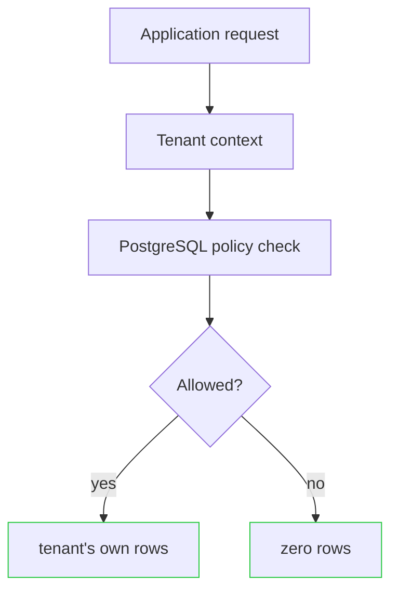
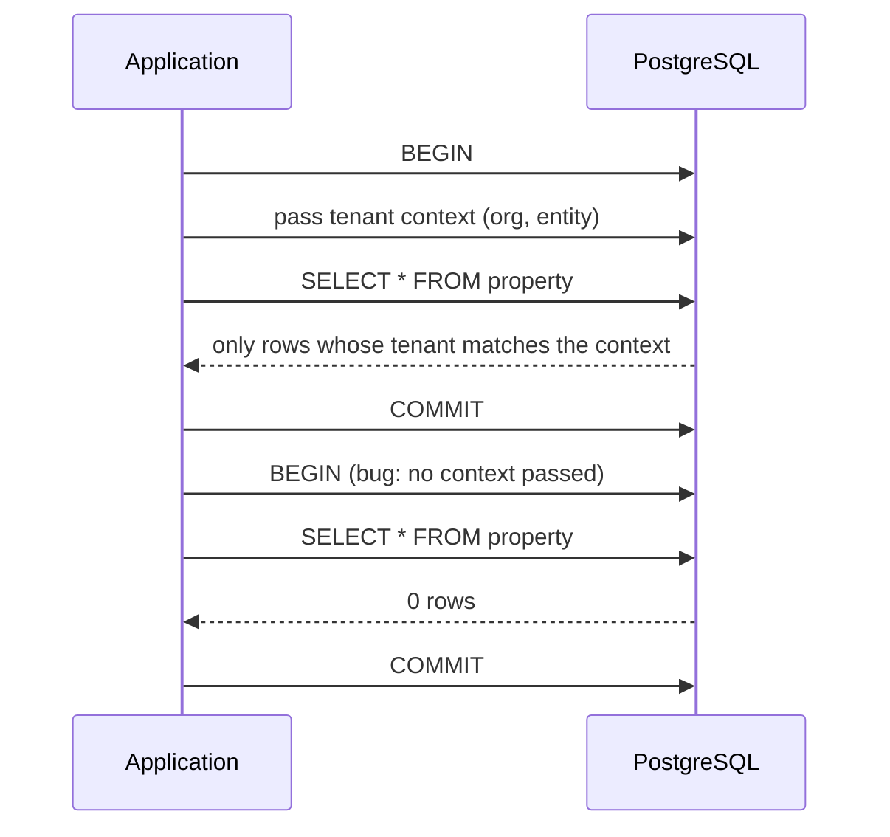

# PMLAD — property-management software

**PMLAD is property-management software designed to improve the day-to-day loop between property managers, properties, and tenants — from maintenance and communication to reporting and operational workflows.**

The broader project is being built with agent-assisted operations in mind: software should help coordinate routine property-management work while keeping sensitive tenant and property data behind strong system boundaries.

## What this repository shows

This is not the full PMLAD application. It is a public showcase of selected backend engineering from the private project.

The focus here is **multi-tenant architecture**: how the system keeps one organization's properties, tenants, and operational data isolated from every other organization — even when application code makes a mistake.



| Request | Result |
|---|---|
| Correct tenant context | the tenant's own data |
| Missing context (the bug) | no data |
| Wrong tenant | no data |

Nothing in the application blocks the second and third cases. The database does.

## The product

Property management runs on coordination: maintenance requests moving between tenants and managers, rent and invoice tracking, unit turnover, and a constant stream of small operational decisions. PMLAD carries that coordination in software — a multi-tenant platform covering properties, units, tenants, leases, invoices, and work orders, with portfolio dashboards on top.

Its direction is to assist the coordination itself: surfacing what needs attention, drafting repetitive communication, and eventually executing routine property workflows with human approval — always inside the same boundaries the rest of the platform enforces.

## See it work

```bash
docker compose up -d          # throwaway Postgres 16
./scripts/default-deny-demo.sh
```

```text
1. SCOPED QUERY   (app set tenant context)    → 2 rows
2. UNSCOPED QUERY (app forgot the context)    → 0 rows
3. CROSS-TENANT   (A asking for B's rows)     → 0 rows
```

- Case 1 is a normal request: the app states which tenant it is acting for, and gets that tenant's rows.
- Cases 2 and 3 are the failure modes that leak data in most stacks. Here both return nothing.
- A full 13-group suite (`./scripts/validate-rls.sh`) runs the same checks plus write attempts, forged context, and bypass attempts — 13/13 pass.

## How tenant isolation survives application mistakes



## Engineering highlights

### 1. Database-enforced tenant isolation

A multi-tenant application can filter records in application code, but that makes every query responsible for remembering the tenant boundary. One forgotten filter in one endpoint, and customers see each other's data.

PMLAD moves that boundary into PostgreSQL. Row-level security evaluates tenant context for every protected query, so a missing application filter does not automatically become cross-tenant access. The tradeoff is deliberate: a query without valid context silently returns nothing, which can be harder to debug than an error — a confusing empty result beats a cross-tenant leak.

### 2. Tenant context travels safely into the database

Every database operation needs to know which organization it belongs to. PMLAD passes that tenant context into the database for the lifetime of a transaction, where PostgreSQL uses it to enforce access.

Technically, the context is set with transaction-scoped `SET LOCAL` state — it expires with the transaction, so it can't leak to the next request on a pooled connection. Postgres session variables can't be parameterized like ordinary values, so every tenant id is validated against a strict UUID format before it is ever interpolated. Malformed input fails closed before reaching the database.

### 3. Adversarial verification and safe failure

An isolation claim is only as good as the tests trying to break it. The validation suite runs as plain SQL against the live database and deliberately attempts the failures that matter: missing context, wrong tenant, cross-tenant writes, forged or empty context, and a session trying to switch row-level security off (the database errors instead of complying). The same suite runs in staging with writes and in production read-only before any deploy.

## Project status

| Capability | Status |
|---|---|
| Core property-management application (properties, units, tenants, leases, invoices) | Built |
| Maintenance / work-order workflows | Built |
| Portfolio dashboards and reporting | Built |
| Multi-tenant architecture | Built |
| Tenant-isolation subsystem shown in this showcase | Built — validated and deployed to the private application's production database |
| AI-assisted property workflows | Product direction |

## Run this showcase

```bash
docker compose up -d
./scripts/default-deny-demo.sh   # the 3-case outcome above
./scripts/validate-rls.sh        # full adversarial suite (13 groups)
./scripts/verify-rls.sh          # structural CI gate
```

Requires Docker and `psql`.

## Public showcase scope

| Component | Status | Detail |
|---|---|---|
| RLS policy design | Real | Faithful reconstruction of the production policy pattern (default-deny, `FORCE RLS`, separate read/write rules). |
| Tenant-context protocol | Reconstructed | Generic names; original role names and database names replaced. |
| Validation suite | Reconstructed | Same structure and edge cases as the production suite; fewer tables (3 vs 12). |
| Data model | Reconstructed | Minimal equivalent: Organization → Entity → Property/Invoice. |
| Seed data | Mocked | Fixed UUIDs, no real customer data. |
| Infrastructure & app framework | Omitted | No cloud infra, auth provider, or app framework — the context-propagation pattern is documented above. |
| Credentials | Sanitized | Demo-only password for a throwaway Docker Postgres. |

## About

Built by Sebastian O. Rodriguez. PMLAD is a deployed private application in active dogfooding; the isolation design shown here is the one enforced on its production database.
