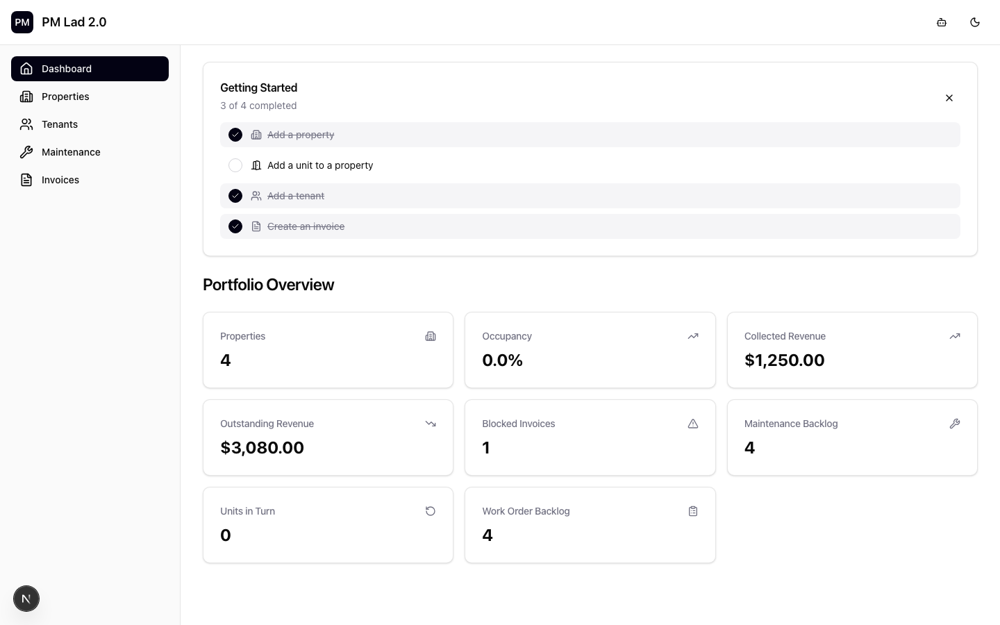
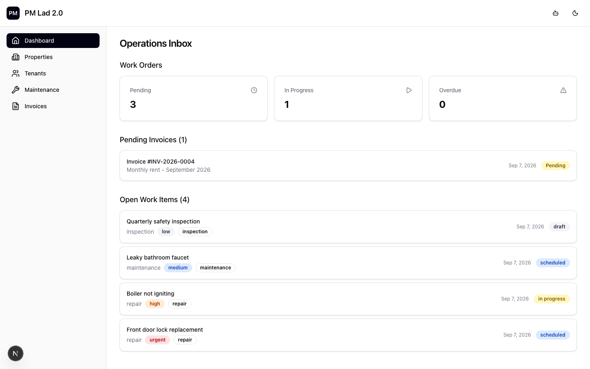
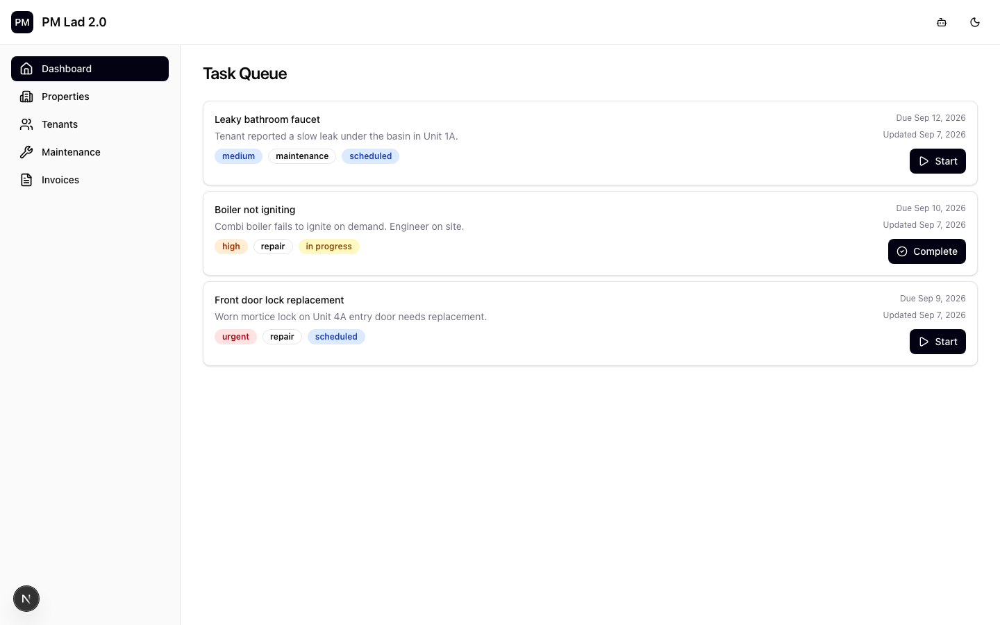

# PMLAD

<p align="center"><strong>Property-management software for running properties, tenants, maintenance, payments, and reporting in one system.</strong></p>

Property management has coordination everywhere:

```text
Properties
    ↓
Tenants
    ↓
Leases
    ↓
Maintenance
    ↓
Payments
    ↓
Reporting
```

PMLAD pulls that work into one operating system.

The goal is a clearer view of the portfolio, a tighter operating loop with tenants, and a foundation for more assisted workflows over time.

<a href="docs/assets/product-portfolio.png">
  
</a>

*Portfolio overview: the owner's view across every property, showing occupancy, collected versus outstanding revenue, blocked invoices, and the maintenance backlog.*

## Contents

- [Overview](#overview)
- [The product](#the-product)
- [How the platform is structured](#how-the-platform-is-structured)
- [Engineering tenant isolation](#engineering-tenant-isolation)
- [Where PMLAD is headed](#where-pmlad-is-headed)
- [About this repository](#about-this-repository)

## Overview

Most software in this space is an accounting package, a listing tool, or a spreadsheet with extra steps. None of them treat the operating loop as the product.

That loop is the daily back-and-forth between an owner, a property manager, and the people doing the work. PMLAD starts there. Leases, maintenance requests, invoices, tenant communication, and unit turns are the work; reporting falls out of that work naturally instead of being bolted on afterward.

## The product

The interface is organized around the roles doing the work, not around a dashboard you have to decode. The screenshots come from the running application with synthetic demo data.

**Owners** see portfolio health across every property, the hero above.

**Property managers** work an operational inbox: invoices awaiting approval, unit turns in progress, open work orders.

<a href="docs/assets/product-inbox.png">
  
</a>

*Operational inbox: work orders grouped by state, plus invoices waiting on approval. The daily workflow, not a report of it.*

**Technicians** see the tasks assigned to them.

<a href="docs/assets/product-tasks.png">
  
</a>

*Task queue: assigned work orders with priority, category, status, and due date.*

Behind those workflows are the core records that keep the operation running: properties, residents, invoices, and maintenance.

## How the platform is structured

PMLAD is a multi-tenant product. The product model groups everything around the objects a property manager already thinks in.

```text
                    PMLAD

Properties        Tenants        Operations
    ↓                ↓               ↓
 Units            Leases         Maintenance
 Occupancy        Requests       Payments
 Reporting        Communication  Follow-up
```

Properties own units, occupancy, and reporting. Tenants own leases, requests, and the resident communication loop. Operations is maintenance, payments, and follow-up. The work flows through those relationships, not through a flat list of features.

## Engineering tenant isolation

PMLAD is a multi-tenant application. Multiple property-management organizations can use the same system, but their properties, tenants, leases, invoices, and maintenance records must remain isolated.

Application-level filters help enforce that boundary, but they depend on every query being written correctly. PMLAD adds a second boundary inside PostgreSQL so the database itself can reject data that does not belong to the active tenant.

```text
Application request
        ↓
Tenant context
        ↓
PostgreSQL
        ↓
Tenant policy
     ↙     ↘
Allowed   Denied
   ↓         ↓
Own data   No data
```

The boundary breaks the failure cases in a predictable direction:

```text
Correct tenant  → own data
Missing context → no data
Wrong tenant    → no data
```

Three ideas carry the whole design.

**Database-enforced isolation.** Row-level security evaluates tenant context on every protected query. If the context is missing or wrong, PostgreSQL returns zero rows.

**Transaction-scoped tenant context.** Context travels into each transaction with `SET LOCAL` and dies when the transaction ends, so it cannot leak onto a pooled connection. Tenant ids are validated before interpolation, and a missing context coalesces to the nil UUID that matches no real row.

**Default-deny behavior.** A query without valid context returns nothing rather than throwing. A quiet empty result beats a cross-tenant leak every time.

The boundary is proven with a SQL-based validation suite that runs the failures that matter: unscoped queries, cross-tenant reads and writes, forged context, and an attempt to disable row-level security.

## Where PMLAD is headed

The direction is assisted operations. The system should surface the invoice that has been stuck, flag the unit turn about to breach its SLA, and draft the repetitive communication, with a human approving before anything runs.

Every automated action stays explainable. You can trace why a status changed or where a number came from. Natural-language questions about the portfolio become data-backed answers over the same operational records, never a second source of truth. The system remains fully runnable by a person, with or without those supporting interfaces.

## About this repository

PMLAD is a larger private project, deployed and in active use. This public repository contains a reconstructed, public-safe version of the multi-tenant isolation layer so the architecture can be inspected and run without exposing private application code, data, or infrastructure.

## Run it locally

```bash
docker compose up -d
./scripts/default-deny-demo.sh
./scripts/validate-rls.sh
```

Requires Docker and `psql`.