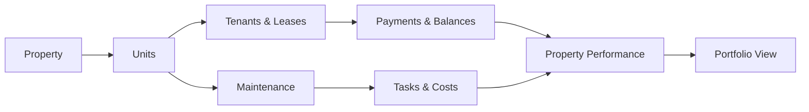
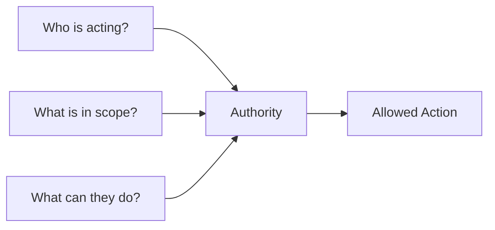
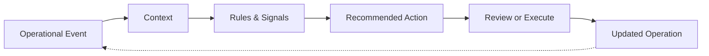

<h1>The PMLaD: Property Operations in One System</h1>

<em>A product and engineering showcase of the PMLaD.</em>

Property operations break down when work is scattered across spreadsheets, messages, point tools, and manual follow-up. PMLaD brings properties, tenants, maintenance, payments, and field work into one system so teams can see what matters, act faster, and keep accountability intact.

  

<em>Portfolio: A single operating view across performance, exposure, and open work.</em>

<h2>One Flow, Multiple Audiences</h2>

Managing properties means keeping dozens of small but consequential actions organized, prioritized, and tracked, such as:

<ul>
  <li>Tracking properties, units, tenants, and leases</li>
  <li>Collecting payments and following up on outstanding balances</li>
  <li>Receiving, assigning, and resolving maintenance requests</li>
  <li>Coordinating field work and unit turns</li>
  <li>Reviewing invoices and controlling operating costs</li>
  <li>Managing vacancies and upcoming renewals</li>
  <li>Monitoring occupancy, revenue, and portfolio performance</li>
</ul>

The challenge is not any one workflow. It is keeping track of the moving parts, knowing what needs attention, and making sure nothing disappears between people, tools, or handoffs.

A maintenance issue can delay a unit turn. A delayed turn affects occupancy. Occupancy affects revenue. An unresolved invoice affects cash flow. A missed renewal creates avoidable vacancy.

PMLaD treats those as connected parts of the same operation.

<blockquote>
<strong>One place for tracking. One place for action.</strong>
</blockquote>

That creates a simpler operating model: fewer gaps, faster follow-up, clearer accountability, easier onboarding of new properties and tenants, and tighter feedback loops between tenants, managers, owners, and service teams.

The result is practical. The faucet gets fixed faster. The invoice gets approved sooner. The manager spends less time chasing status. The owner sees the portfolio without rebuilding the story manually.

<h2>See the Product in Action</h2>

<h3>See the Portfolio Clearly</h3>

Owners need the big picture without digging through every operational detail.

PMLaD brings occupancy, revenue, outstanding balances, maintenance activity, blocked invoices, and open work into one portfolio view so performance and operational risk stay visible together.

<h3>Keep the Operation Moving</h3>

Property managers sit at the center of the work: resolving blockers, approving costs, coordinating maintenance, and making sure the next action happens.

The PMLaD inbox brings that work into one queue, including open work orders, approvals, invoices, unit turns, and other items that need attention now.

  

<em>Inbox: The work that needs a decision, approval, or next action.</em>

<h3>Give Field Teams the Context to Act</h3>

Field workers should not need to call around to understand what they were assigned.

PMLaD gives them the property, task, priority, due date, status, and context needed to do the work and keep everyone else informed.

  

<em>Tasks: Clear assignments with the context needed to execute.</em>

<h2>Engineering the Operation</h2>

The product experience is simple by design. Underneath it are three core decisions: model the operation as a connected system, scope authority to the work, and use that context to drive better next actions.

<h3>Model the Operation, Not the Screens</h3>

PMLaD does not treat maintenance, payments, leases, and reporting as isolated features. The product views sit on top of the same underlying operational model, so the relationships between properties, people, work, and money stay intact.

<em>Operational activity stays connected from the unit level through portfolio performance.</em>

A maintenance request keeps its property, unit, tenant, assigned work, and cost context as it moves through the system. A payment remains tied to the tenant and lease while contributing to balances and property performance.

That context does not need to be rebuilt every time the work changes hands.

<blockquote>
<strong>Design principle:</strong> Capture context once. Keep it attached to the work.
</blockquote>

<h3>Scope Authority to the Work</h3>

A shared operational model only works if responsibility and authority remain clear.

Owners, managers, tenants, and field workers can participate in the same operation without having the same access or control.

<em>Authority is determined by the actor, the operational scope, and the action being attempted.</em>

PMLaD carries that authority through the workflow so people can act on what they are responsible for without exposing or controlling the entire operation.

That supports clearer accountability today and creates a safer foundation for more automated workflows later.

<h3>Turn Operational Context Into Action</h3>

Once the system understands the property, the work in progress, the people involved, and their authority, it can begin helping with what should happen next.

<em>Operational events become context, context informs the next action, and the result feeds back into the operation.</em>

Maintenance history can help surface the next service action. Lease dates can bring renewals forward before they become vacancy risk. Managers can query what is overdue, blocked, or at risk using the same records already driving the product.

Whether that work begins from a dashboard, recommendation, automation, or conversation, it operates against the same operational context and authority model.

<blockquote>
<strong>Product direction:</strong> Reduce coordination overhead without losing control, context, or accountability.
</blockquote>

<h2>About This Showcase</h2>

This repository showcases selected product experiences and engineering decisions behind PMLaD: how property work is organized, how operational context is preserved across workflows, how authority is scoped, and how that foundation can support more assisted operations over time.

It is a showcase of the product and the thinking behind it, not the production application or a release of proprietary production code.

