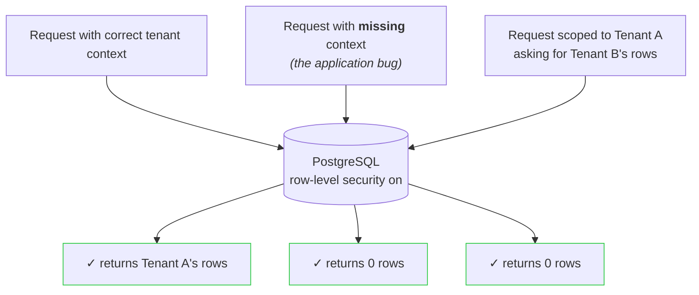
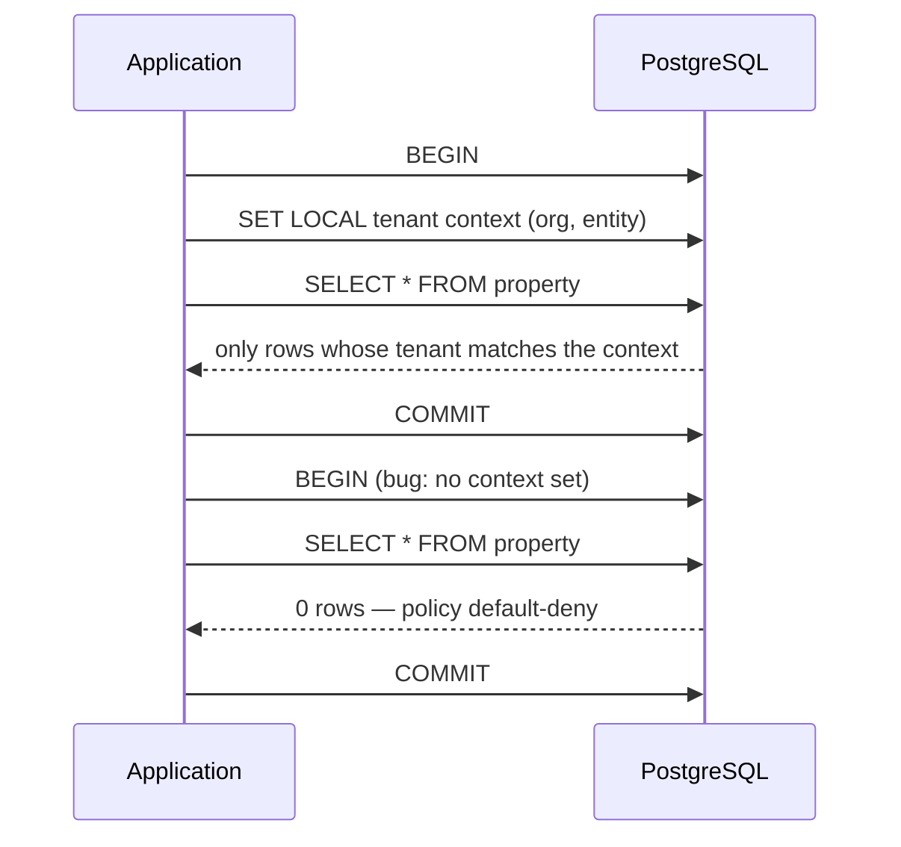

# PMLAD — AI-native property management

**PMLAD is an AI-native property management platform designed to make property operations simpler for managers and tenants — from maintenance workflows and tenant communication to reporting and assisted operations.**

The broader project explores how agentic workflows can reduce the manual coordination involved in property management while keeping sensitive tenant and property data behind explicit security boundaries.

**Showcase focus: multi-tenant isolation** — the boundary that makes the rest of the product safe to build on:



Nothing in the application blocks the second and third requests. The database does.

## The Product

Property management runs on coordination: maintenance requests moving between tenants and managers, rent and invoice tracking, unit turnover, and a constant stream of small operational decisions. PMLAD exists to carry that coordination in software — a multi-tenant platform covering properties, units, tenants, leases, invoices, and work orders, with portfolio dashboards on top.

Its AI-native direction is to assist the coordination itself: surfacing what needs attention, drafting the repetitive communication, and eventually executing routine property workflows with human approval — always inside the same explicit security boundaries the rest of the platform enforces.

## What This Showcase Covers

> **About this repository**
>
> This is a public showcase of selected engineering from the larger private PMLAD project. It is intentionally not the full application. The repository focuses on a technically meaningful subsystem that can be demonstrated publicly without exposing private code, data, or infrastructure.

This repository reconstructs selected backend architecture from the private project around one foundational requirement for the larger system: safe multi-tenant data isolation. It demonstrates how tenant boundaries are enforced at the database layer so missing or incorrect application context fails closed rather than exposing another tenant's data.

## See It Work

```bash
docker compose up -d          # throwaway Postgres 16
./scripts/default-deny-demo.sh
```

```text
1. SCOPED QUERY   (app set tenant context)    → 2 rows
2. UNSCOPED QUERY (app forgot the context)    → 0 rows
3. CROSS-TENANT   (A asking for B's rows)     → 0 rows
```

- Case 1 is a normal request: the app states which tenant it is acting for, and gets that tenant's rows.
- Cases 2 and 3 are the failure modes that leak data in most stacks. Here both return nothing.
- A full 13-group suite (`./scripts/validate-rls.sh`) runs the same checks plus write attempts, forged context, and bypass attempts — 13/13 pass.

## How It Works



1. Every request states its tenant context inside its own transaction.
2. Every tenant table has a row-level security policy that compares each row against that context.
3. No context, wrong context, or missing context → the policy matches nothing → zero rows.

## Engineering Highlights

### 1. Database-enforced tenant isolation

In a typical multi-tenant app, isolation lives in application code: every query must include `WHERE tenant_id = :current_tenant`. One forgotten filter in one endpoint, and customers see each other's data. Row-level security policies move enforcement to the one layer that sees every query, so a bug that omits the filter returns an empty result instead of another tenant's rows. The tradeoff is deliberate: a query without valid context silently returns nothing, which can be harder to debug than an error — a confusing empty result beats a cross-tenant leak.

### 2. Request-to-database tenant context

Postgres session variables can't be parameterized like ordinary values, so setting them from application data is an injection risk. Context is set inside the request's own transaction (`SET LOCAL`, so it expires with the transaction and can't leak to the next request on a pooled connection), and every tenant id is validated against a strict UUID format before it is ever interpolated. Malformed input fails closed before reaching the database.

### 3. Adversarial verification and safe failure

An isolation claim is only as good as the tests trying to break it. The validation suite runs as plain SQL against the live database and deliberately attempts the failures that matter: missing context, wrong tenant, cross-tenant writes, forged or empty context, and a session trying to switch row-level security off (the database errors instead of complying). The same suite runs in staging with writes and in production read-only before any deploy.

## Project Status

| Capability | Status |
|---|---|
| Core property-management application (properties, units, tenants, leases, invoices) | Built |
| Maintenance / work-order workflows | Built |
| Portfolio dashboards and reporting | Built |
| Multi-tenant architecture | Built |
| Tenant-isolation subsystem shown in this showcase | Built — deployed to production in the private project |
| AI-assisted property workflows | Product direction |

## Run This Showcase

```bash
docker compose up -d
./scripts/default-deny-demo.sh   # the 3-case outcome above
./scripts/validate-rls.sh        # full adversarial suite (13 groups)
./scripts/verify-rls.sh          # structural CI gate
```

Requires Docker and `psql`.

## Public Showcase Scope

| Component | Status | Detail |
|---|---|---|
| RLS policy design | Real | Faithful reconstruction of the production policy pattern (default-deny, `FORCE RLS`, separate read/write rules). |
| Tenant-context protocol | Reconstructed | Generic names; original role names and database names replaced. |
| Validation suite | Reconstructed | Same structure and edge cases as the production suite; fewer tables (3 vs 12). |
| Data model | Reconstructed | Minimal equivalent: Organization → Entity → Property/Invoice. |
| Seed data | Mocked | Fixed UUIDs, no real customer data. |
| Infrastructure & app framework | Omitted | No cloud infra, auth provider, or app framework — the context-propagation pattern is documented above. |
| Credentials | Sanitized | Demo-only password for a throwaway Docker Postgres. |

## About

Built by Sebastian O. Rodriguez. The private PMLAD project is a launched multi-tenant SaaS in active use; the isolation design shown here runs on its production database today.
