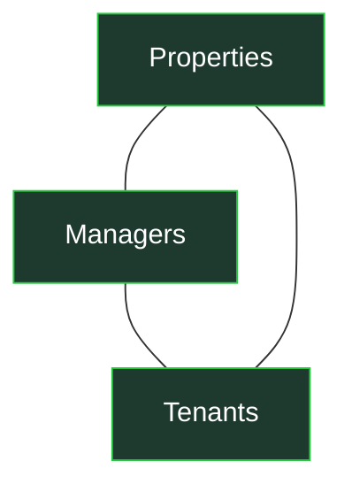
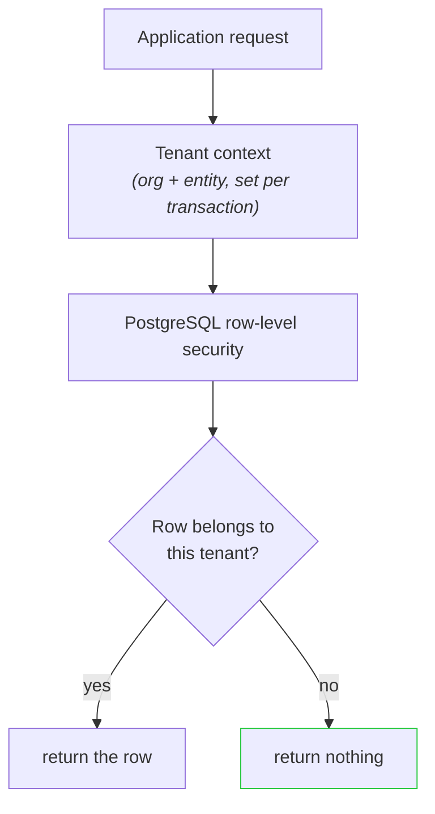

# PMLAD — the operating system behind property management

Property management is coordination-heavy work. A manager is constantly moving between properties, tenants, leases, maintenance requests, invoices, communication, and reporting — and a lot of that still happens across disconnected tools and manual follow-up.

PMLAD is my attempt to turn that into one integrated system: a place to run the portfolio, tighten the loop between managers and tenants, and gradually hand the repetitive parts of the work to software.

## Why it exists

Most software in this space is either an accounting package, a listing tool, or a spreadsheet with extra steps. None of them treat the *operating loop* — the daily back-and-forth between an owner, a property manager, and the people doing the work — as the product.

PMLAD starts from that loop.



The work that flows through those relationships — leases, maintenance requests, invoices, resident communication, unit turns — is the product. Reporting falls out of that work naturally instead of being bolted on afterward.

## What the product does

The interface is organized around the roles doing the work, not around a dashboard you have to decode:

- **Owners** get a portfolio view — occupancy, revenue, blocked invoices, and maintenance backlog across every property.
- **Property managers** get an operational inbox — invoices awaiting approval, unit turns in progress, open work orders. It's the daily workflow, not a report of it.
- **Technicians** get a task queue — assigned work orders with priority, due time, and location.

Underneath, every entity — property, resident, invoice, work order — is scoped to the organization that owns it. More on that below, because it's the part this repository exists to show.

## Where it's going

The longer-term direction is to make the software increasingly capable of *noticing* what needs attention and *preparing* the routine work — drafting the repetitive communication, surfacing the invoice that's been stuck, flagging the unit turn that's about to breach its SLA — with a human approving before anything is executed.

The design principle throughout: AI and natural-language are supporting interfaces. The system has to be fully runnable by a person, with or without them. Every automated action has to be explainable — you should be able to trace *why* a status changed or a number appeared.

---

## The problem you can't see from the screenshots

A product like this has one failure mode that would make every feature irrelevant: **isolation**.

Multiple property-management organizations run on the same application. Their tenants, leases, invoices, and maintenance records must never bleed across organizational boundaries — not through a bug, not through a forgotten filter, not through an over-privileged database role.

That's the subsystem this public repository exists to demonstrate.

### Why the boundary lives in the database

A common approach is to filter records in application code — every query remembers to add `WHERE organization_id = ?`. That works until the one endpoint that forgets. One forgotten filter is all it takes for one customer to see another customer's data, and "we have filters everywhere" is not a boundary. It's a convention.

PMLAD moves the boundary into PostgreSQL itself:



Row-level security evaluates the tenant context for *every* protected query. The application doesn't get a vote after the query is written — if the context is missing or wrong, the database returns zero rows. That's the default-deny posture: nothing in the application blocks the failure cases; the database does.

| Request | Result |
|---|---|
| Correct tenant context | the tenant's own rows |
| Missing context (the bug) | no rows |
| Wrong tenant | no rows |

### How tenant context reaches the database safely

Every database operation needs to know which organization it belongs to. PMLAD passes that context into the database for the lifetime of a transaction:

- The context is set with transaction-scoped `SET LOCAL` state — it expires when the transaction ends, so it can't leak onto a pooled connection and show up in the next request.
- Postgres session variables can't be parameterized like normal values, so every tenant id is validated against a strict UUID format *before* it's interpolated. Malformed input fails closed before it ever reaches the database.
- A missing or empty context coalesces to the nil UUID (`00000000-…`), which matches no real row. There's no "unset means open" path.

### Proving the boundary holds

An isolation claim is only as good as the tests trying to break it. The validation suite runs as plain SQL against the live database and deliberately attempts the failures that actually matter:

```text
1. SCOPED QUERY   (app set tenant context)    → the tenant's rows
2. UNSCOPED QUERY (app forgot the context)    → 0 rows
3. CROSS-TENANT   (A asking for B's rows)     → 0 rows
```

Plus the adversarial cases: cross-tenant writes, forged or empty context, and a session trying to switch row-level security off (the database errors instead of complying). The same suite runs in staging with writes and read-only in production before any deploy.

There's a deliberate tradeoff worth naming: a query without valid context silently returns *nothing* rather than throwing. That's harder to debug than an error — but a confusing empty result beats a cross-tenant leak, every time.

## About this repository

PMLAD is a larger private project, deployed and in active use. This public repository contains a reconstructed, public-safe version of the multi-tenant isolation layer — the schema, the row-level security policies, and the adversarial validation suite — so the architecture can be inspected and run without exposing private application code, data, or infrastructure. The model is a minimal equivalent (`organization → entity → property/invoice`), names are generic, and the seed data is fixed fixtures, not real customers.

## Run it locally

```bash
docker compose up -d          # throwaway Postgres 16
./scripts/default-deny-demo.sh  # the 3-case outcome above
./scripts/validate-rls.sh     # full adversarial suite (13 groups)
```

Requires Docker and `psql`.
